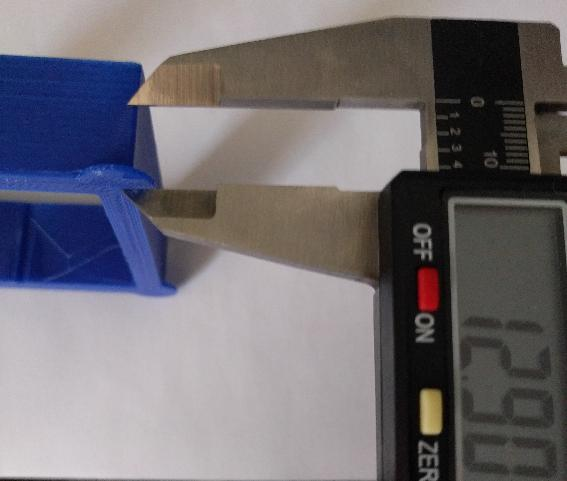
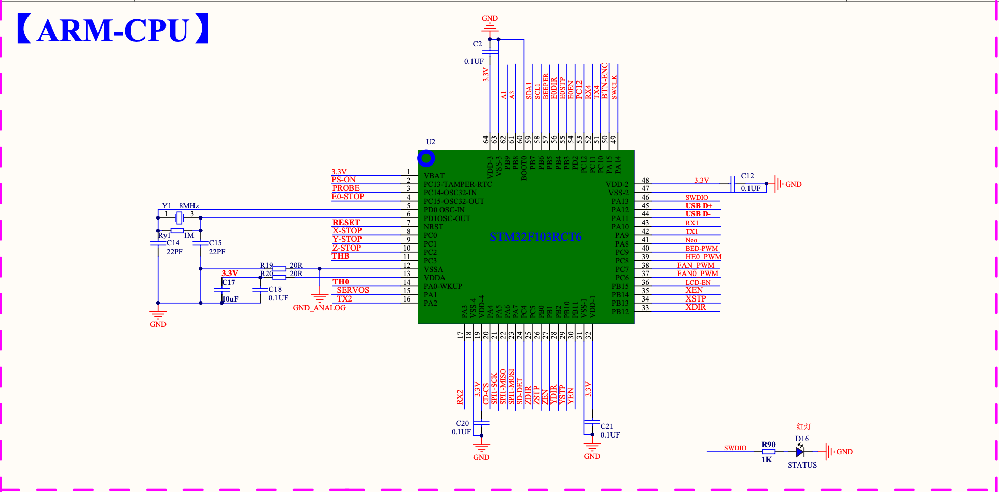
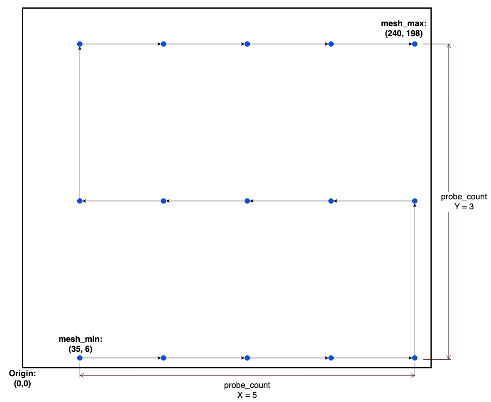
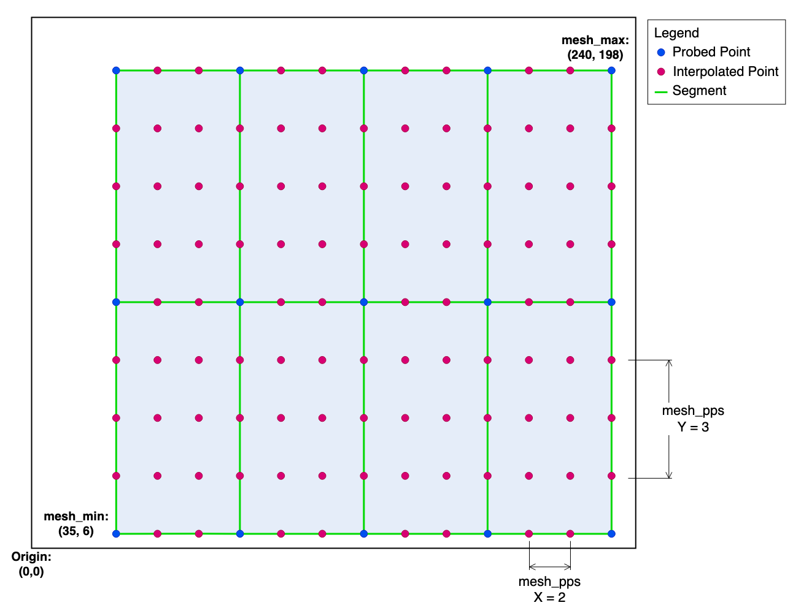



## 前置き

我が家の3Dプリンタのファームウェアを Marlin から Klipper に変更し、あわせてプリンタ操作ツールを OctoPrint から FluiddPi に変更しましたので、インストール方法などをメモしておきます。

順不同であれこれ書いていますので、必要に応じて上の目次を利用してください。

## 作業の順番

作業は次の順番で行います。

1. FluiddPi をRaspberryPi にインストール
1. 1.の RaspberryPi に Kiuah をインストール
1. Kiuah を使って Klipper をインストール
1. Klipper を設定

## FluiddPi のインストール

[FluiddPI - Fluidd](https://docs.fluidd.xyz/installation/fluiddpi) からイメージファイルをダウンロードし、[Raspberry Pi Imager](https://www.raspberrypi.com/software/) を使って MicroSD カードにイメージファイルを書き込みます。

イメージを書き込んだら、MicroSD カードの `fluiddpi-wpa-supplicant.txt` ファイルを開いて無線LANの設定を行います。それからカードを RaspberryPi に差し込んで起動します。

RaspberryPi が起動してしばらくしたら、作業用PCで `ssh pi@fluiddpi.local` コマンドを実行して RaspberryPi に SSH 接続し、`sudo raspi-config` を実行して次の設定を行います。

- System Options -> Password でパスワードを変更します
- Localization Options -> Timezone でタイムゾーンを変更します
- Localization Options -> Locale でローカル設定を変更します
- 必要に応じて System Options -> Hostname でホスト名を変更します

`http://fluidd.local` にアクセスして FluiddPi の画面が表示されることを確認します。

FluiddPi の画面が表示されたら、ひとまずカメラの設定を行います。

私は Logitech の C270 カメラを利用していますので、左の Configuration タブにある `webcam.txt` ファイルを開いて `camera_usb_options` をアンコメントします。画面解像度は、FluiddPi の中の小さな画面で見ますので `640x480` とし、フレームレートを `30` にしています。

それから Settings の Cameras でカメラを追加します。`Stream type` は `MJPEG Adaptive` にします。

## Kiuah のインストール

Klipper のビルドや各種アップデートを簡単に行うため、[Kiuah](https://github.com/th33xitus/kiauh) をインストールします。インストールは以下のコマンドで行います。

```bash
cd ~
git clone https://github.com/th33xitus/kiauh.git
```

## Klipper ファームウェアのビルド & インストール

Kiuah をインストールしたら、`./kiauh/kiauh.sh` を実行し、`4) [Advanced]` を選択してメニューを開きます。

```
/=======================================================\
|     ~~~~~~~~~~~~~~~~~ [ KIAUH ] ~~~~~~~~~~~~~~~~~     |
|        Klipper Installation And Update Helper         |
|     ~~~~~~~~~~~~~~~~~~~~~~~~~~~~~~~~~~~~~~~~~~~~~     |
\=======================================================/
/=======================================================\
|     ~~~~~~~~~~~~~~~ [ Main Menu ] ~~~~~~~~~~~~~~~     |
|-------------------------------------------------------|
|  0) [Upload Log]     |       Klipper: Installed: 1    |
|                      |        Branch: master          |
|  1) [Install]        |                                |
|  2) [Update]         |     Moonraker: Installed: 1    |
|  3) [Remove]         |                                |
|  4) [Advanced]       |      Mainsail: Not installed!  |
|  5) [Backup]         |        Fluidd: Installed!      |
|                      | KlipperScreen: Not installed!  |
|  6) [Settings]       |  Telegram Bot: Not installed!  |
|                      |                                |
|                      |          DWC2: Not installed!  |
|  v3.1.0-85           |     Octoprint: Not installed!  |
|-------------------------------------------------------|
|                        Q) Quit                        |
\=======================================================/
Perform action: 4
```

メニューを開いたら、`3) [Build only]` を選択してファームウェアビルドのオプション画面に移ります。

```
/=======================================================\
|     ~~~~~~~~~~~~~~~~~ [ KIAUH ] ~~~~~~~~~~~~~~~~~     |
|        Klipper Installation And Update Helper         |
|     ~~~~~~~~~~~~~~~~~~~~~~~~~~~~~~~~~~~~~~~~~~~~~     |
\=======================================================/
/=======================================================\
|     ~~~~~~~~~~~~~ [ Advanced Menu ] ~~~~~~~~~~~~~     |
|-------------------------------------------------------|
|  Klipper:                 |  Mainsail:                |
|  1) [Switch Branch]       |  7) [Theme installer]     |
|  2) [Rollback]            |                           |
|                           |  System:                  |
|  Firmware:                |  8) [Change hostname]     |
|  3) [Build only]          |                           |
|  4) [Flash only]          |  Extensions:              |
|  5) [Build + Flash]       |  9) [Shell Command]       |
|  6) [Get MCU ID]          |                           |
|                           |  CustomPiOS:              |
|                           |  10) [Migration Helper]   |
|-------------------------------------------------------|
|                       B) « Back                       |
\=======================================================/
Perform action: 3
```

ファームウェアビルドのオプション画面が開きますので、必要な設定を行って保存するとファームウェアがビルドされて `~/klipper/out/klipper.elf` に保存されます。

あとは、作業用 PC で `scp pi@fluiddpi.local:~/klipper/out/klipper.bin ~/` を実行してファームウェアをダウンロードし、プリンタに書き込みます。


## Klipper の設定

Klipper の設定は、`~/klipper_config/printer.cfg` を編集して行います。

Fliddpi をインストールした RaspberryPi の `~/klipper/config/` ディレクトリには主要なマザーボードの設定例が保存されていますので、自分に合ったものを `cp ~/klipper/config/generic-einsy-rambo.cfg ~/klipper_config/printer.cfg`  でコピーして編集していきます。なお、FluiddPi の Configuration タブの Other Files の CONFIG_EXAMPLES からも同じ設定例にアクセスできます。

なお、Prusa MK3S+ については、Klipper の Github の[プルリク](https://github.com/Klipper3d/klipper/pull/4080?w=1)に「Prusa i3 MK3S に合わせた `printer.cfg` を作成したので [`config/printer-prusa-mk3s-2021.cfg`](https://github.com/Klipper3d/klipper/pull/4080/files#diff-d10f346fb8c271a10682675f9f1fc0a98076073f37f820aadff3a8469c13c490) として追加して欲しい」とがありましたので、これを元に設定していきました。

### 移動距離の調整

Marlin では「プリンタを 1mm 動かすのにステッピングモーターを何ステップ動かすか」を設定する `steps_per_mm` でプリントヘッドやベッドの移動距離を調整していましたが、Klipper では「ステッピングモーターが完全に1回転したときに軸方向に動く距離」を設定する `rotation_distance` で調整します。

[klipper/docs/Rotation_Distance.md at master · Klipper3d/klipper](https://github.com/Klipper3d/klipper/blob/master/docs/Rotation_Distance.md)

<div class="alert alert-info" role="alert">
  &#x2139; 以前は `step_distance` という項目で調整されていましたが、2021年11月2日の変更でこの項目は使えなくなっています。
</div>

`rotation_distance` を求める方法は次の4つですが、上記で説明した `printer.cfg` の見本には標準的な値が設定されていますので、そちらを用いて微調整する方が早いと思います。

`rotation_distance` の値はプリンタの部品で決まるため、`printer.cfg` の見本がない場合、同じ部品を使っているプリンタの値を流用すれば大丈夫だと思います。

1. ベルトのピッチとプーリーの歯の数から求める方法 (XY 軸)
1. リードスクリューのピッチとスレッド数から求める方法 (Z 軸)
1. エクストルーダーのホブボルトの直径から求める方法 (エクストルーダー)
1. `step_distance` から求める方法 (古い設定例を用いる場合)

#### 調整方法の具体的な内容

##### ベルトのピッチとプーリーの歯の数から求める方法

公式リファレンスに掲載されている次の計算式で求めます。

```
rotation_distance = ベルトのピッチ数 * プーリーの歯の数
（筆者翻訳）
```

2mmピッチのベルトと20歯のプーリーを使っていれば `2 * 20 = 40` となります。

##### リードスクリューのピッチとスレッド数から求める方法

公式リファレンスに掲載されている次の計算式で求めます。

```
rotation_distance = ピッチ数 * スレッド数
（筆者翻訳）
```

3Dプリンタで良く使われる T8 リードスクリューの場合、ピッチ数が 2 でスレッド数が 4 なので、`2 * 4 = 8` となります。


##### エクストルーダーのホブボルトの直径から求める方法

ホブボルトとは、次の写真のような溝付きボルトのことのようです。このボルトの直径を公式リファレンスに掲載されている計算式に代入して求めます。

```
rotation_distance = <diameter> * 3.14
```

ただ、エクストルーダーの場合、後述の「rotation_distance の調整」に沿って調整する方が手っ取り早いと思います。


#### `step_distance` から求める方法

公式リファレンスに掲載されている次の計算式で求めます。

```
rotation_distance = <full_steps_per_rotation> * <microsteps> * <step_distance>
```

full_steps_per_rotation
: ステッピングモーターが一回転するためのステップ数です。モーターの最小回転角が 1.8度なら `200` に、0.9度なら `400` になります。	

私の Prusa で使用中のモーターは全て最小回転角が1.8度なので、`200` を代入します。

microsteps
: モータードライバーのマイクロステッピング機能です。大抵の場合 1/16 なので `16` を代入します。Prusa の TMC2130 も 1/16 です（実際は補間機能で 1/256 になっています）。

TMC2130 のマイクロステッピングは、[Trinamic が公表しているデータシート](https://www.trinamic.com/fileadmin/assets/Products/ICs_Documents/TMC2130_datasheet.pdf)の86ページで確認できます。

#### ギア比の設定

エクストルーダーなどにギアボックス (BMG Extruder 等) を使っている場合、歯車の歯の数の比に応じて `gear_ratio: 50:17` のように設定します。

注意点は、商品説明で「3:1」のギア比と紹介されていても、歯車の数は「50:17」となっていたりしますので、設定値は歯車の歯の数に基づく必要があります。

#### rotation_distance の調整

エクストルーダーの `rotation_distance` の値の調整は、100ミリ押し出した時に何ミリ押し出されたか確認し、その値を元に `実際に押し出された距離 / 100mm * 現在の設定値` を計算して行います。

XYZ 軸については、[XYZ 20mm Calibration Cube by iDig3Dprinting - Thingiverse](https://www.thingiverse.com/thing:1278865) を印刷して XYZ 方向の実測値を元に `実測値 / 20mm * 現在の設定値` を計算して調整します。

なお、’rotation_distance` は、`steps_per_mm` とは違い、値が小さくなるほど移動量が増えることに注意が必要です。

### PID チューニング

エクストルーダーのチューニングは `PID_CALIBRATE HEATER=extruder TARGET=170` コマンドで行います。コマンドを実行して結果が出たら、`SAVE_CONFIG` コマンドを実行してチューニング結果を `printer.cfg` に保存します。ベッドのチューニングは `PID_CALIBRATE HEATER=heater_bed TARGET=60` コマンドで同様に行います。

### Pressure advance の調整

Pressure advance は、Marlin の `Linear_advance` に相当する機能です。

調整方法は Klipper の[公式リファレンス](https://www.klipper3d.org/Pressure_Advance.html)に掲載されていますが、簡単に言うと、プリンタの設定を一時的に変更してからテスト印刷し、その結果から設定値を計算して `printer.cfg` に設定するというものです。

まず、`SET_VELOCITY_LIMIT SQUARE_CORNER_VELOCITY=1 ACCEL=500` コマンドを実行してコーナーの速度を落とします。速度を落とす理由は、コーナーでエクストルーダーの押し出し効果を強調するためです。

次に、`TUNING_TOWER COMMAND=SET_PRESSURE_ADVANCE PARAMETER=ADVANCE START=0 FACTOR=.005` を実行して、1レイヤー毎に `PRESSURE_ADVANCE` のパラメータを `0` から `0.005` ずつ増やしていきます。なお、ボーデン型のプリンタを使っている場合、`FACTOR=.005` を `FACTOR=.020` にします。

それから [square_tower.stl](https://www.klipper3d.org/prints/square_tower.stl) を次の設定で印刷します。

レイヤーの高さ
: ノズルの直径の 75% とするよう指示されていますので、0.4mm ノズルなら `0.3mm` とします。

速度
: 100mm/s のような高速にし、スライサーの加速度コントロール機能は無効にします。

インフィル
: 0% にします。

トップレイヤー
: 不要なので `0` とします。

印刷が終わったら、底面からコーナーの造形がダメになる部分までの高さを測り、次の式で `PRESSURE_ADVANCE` のパラメータを求めます。なお、この印刷は「上のレイヤーほどコーナーの造形がダメになる」ので、コーナーの造形がダメになった時点で印刷を中止すると時間の節約になります。

<figure class="figure bsimage">
  
  <figcaption class="figure-caption fw-light text-center">
		底面から造形がダメになる部分までの高さを計測</br>
		<a href="https://www.klipper3d.org/Pressure_Advance.html">Klipper documentation Pressure advance </a>より
	</figcaption>
</figure>

```
pressure_advance = <start> + <measured_height> * <factor>.
(For example, 0 + 12.40 * 0.005 would be 0.062.)
```

なお、`PRESSURE_ADVANCE` のパラメータは、温度やフィラメントによって異なりますので、その都度調べる必要があります。

> The pressure advance value is dependent on the extruder, the nozzle, and the filament. It is common for filament from different manufactures or with different pigments to require significantly different pressure advance values. Therefore, one should calibrate pressure advance on each printer and with each spool of filament.
>
> PRESSURE_ADVANCE の値は、エクストルーダー、ノズルまたはフィラメントに依存します。メーカーや顔料が異なるフィラメントでは、PRESSURE_ADVANCE の値が大きく異なるのが一般的です。そのため、フィラメントスプール毎またはプリンター毎に PRESSURE_ADVANCE の値を調整するべきです。（拙訳）
>
> [Pressure advance - Klipper documentation](https://www.klipper3d.org/Pressure_Advance.html#important-notes) より引用


### コマンドでファームウェアを再起動

次のコマンドでファームウェアを再起動できます。これで再起動できない場合、本体の電源を切ることになります。

```bash
curl -X POST fluiddpi.local/printer/firmware_restart
```

[Moonraker Docs » Client Developers » Client API](https://moonraker.readthedocs.io/en/latest/web_api/#firmware-restart)

### Input Shaper

Input Shaper とは、プリンタ自身の振動をキャンセルして印刷物の品質を向上させる機能で、Klipper オリジナルの機能です。大量の計算を必要とするため、現時点では RapberryPi をプリンタの MCU として使用する Klipper しか実現できない機能ではないかと思います。

> Input shaping is an open-loop control technique which creates a commanding signal that cancels its own vibrations.
>
> Input Shaping は、プリンタ自身の振動をキャンセルする制御信号を作成するオープンループの技術です。（拙訳）

この機能を使うにはプリンタ特有の振動を調べる必要があり、調査方法は、手動＆目視で行う方法と加速度センサーを使う方法の2つがあります。最初は手動＆目視で調査を試みましたが、確認が難しかったため加速度センサーを使うことにしました。

#### 事前準備

Input Shaper の測定はハードとソフトの両方で事前準備が必要ですので、それぞれ説明します。

##### ハードの準備

まず、加速度センサーを入手する必要があります。使うセンサーは ADXL345 で、私は Amazon で販売されている HiLetgo のセンサーを使っています。



このセンサーで XY 軸の振動をそれぞれ計測しますが、X 軸の計測ではセンサーをエクストルーダーに、Y 軸の計測ではセンサーをベッドに固定する必要があるため、センサーマウントを設計しました。




このセンサーと Raspberry Pi の接続は次のとおりです。ジャンパワイヤを1本ずつ繋ぐのは面倒なので、2x4 のコネクタと 1x4 のコネクタを作成して少しでも配線を楽にしました。

<figure class="figure bsimage">
  
  <figcaption class="figure-caption fw-light text-center">
		<a href="https://www.klipper3d.org/Measuring_Resonances.html#wiring">Klipper documentation Measuring_Resonances.html#wiring </a>より
	</figcaption>
</figure>

##### ソフトの準備

RapberryPi で Input Shaper の計算を行うため、Python で数値計算を効率的に行うための拡張モジュールである `numpy` をインストールします。

インストールは、`SSH` コマンドで Raspberry pi にログインしてから `~/klippy-env/bin/pip install -v numpy` コマンドを実行して行います。インストールに時間がかかるのでしばし待機します。

`numpy` をインストールしたら、`sudo apt update` でパッケージを更新してから `sudo apt install python-numpy python-matplotlib` を実行して `numpy` が依存するライブラリをインストールします。

次に RapberryPi の MCU を klipper のためのセカンダリ MCU として使うための設定を行います。

まず、以下のコマンドを実行して、RapberryPi をセカンダリ MCU として使うためのスクリプトをデーモンに登録します。

```
cd ~/klipper/
sudo cp "./scripts/klipper-mcu-start.sh" /etc/init.d/klipper_mcu
sudo update-rc.d klipper_mcu defaults
```

次に `sudo raspi-config` を実行して Raspberry Pi の設定画面を開き、`3 Interface Options` -> `P4 SPI` と設定画面を開いて SPI 機能を有効化します。

それから次のコマンドを実行して Klipper のビルドオプション画面を開きます。ビルドオプションでは、`Microcontroller Architecture` を `Linux process` にして設定を保存します。

```
cd ~/klipper/
make menuconfig
```

そして、次のコマンドを実行してファームウェアのビルドと書き込みを行います。

```
sudo service klipper stop
make flash
sudo service klipper start
```

これで RapberryPi をセカンダリ MCU として使う準備が出来ましたので、`printer.cfg` に次の設定を追加します。

```
[mcu rpi]
serial: /tmp/klipper_host_mcu

[adxl345]
cs_pin: rpi:None

[resonance_tester]
accel_chip: adxl345
probe_points:
    100,100,20  # an example
```

以上で事前準備は完了です。

#### 測定

センサーをプリンタに固定して RapberryPi に接続したら、FluiddPi から `SHAPER_CALIBRATE AXIS=X` コマンドを実行して計測と調整を行います。センサーの XYZ 軸の方向を計測したい方向に合わせます。測定が終わったら `SAVE_CONFIG` を実行して測定結果に基づく設定値を `printer.cfg` に保存します。




```
// 測定結果
[x-axis]
21:14:50 // Wait for calculations..
21:14:51 // Calculating the best input shaper parameters for x axis
21:14:52 // Fitted shaper 'zv' frequency = 59.4 Hz (vibrations = 8.1%, smoothing ~= 0.050)
21:14:52 // To avoid too much smoothing with 'zv', suggested max_accel <= 13800 mm/sec^2
21:14:54 // Fitted shaper 'mzv' frequency = 54.0 Hz (vibrations = 0.2%, smoothing ~= 0.070)
21:14:54 // To avoid too much smoothing with 'mzv', suggested max_accel <= 8600 mm/sec^2
21:14:56 // Fitted shaper 'ei' frequency = 64.0 Hz (vibrations = 0.0%, smoothing ~= 0.079)
21:14:56 // To avoid too much smoothing with 'ei', suggested max_accel <= 7600 mm/sec^2
21:14:57 // Fitted shaper '2hump_ei' frequency = 79.8 Hz (vibrations = 0.0%, smoothing ~= 0.085)
21:14:57 // To avoid too much smoothing with '2hump_ei', suggested max_accel <= 7100 mm/sec^2
21:14:59 // Fitted shaper '3hump_ei' frequency = 95.8 Hz (vibrations = 0.0%, smoothing ~= 0.089)
21:14:59 // To avoid too much smoothing with '3hump_ei', suggested max_accel <= 6700 mm/sec^2
21:14:59 // Recommended shaper_type_x = mzv, shaper_freq_x = 54.0 Hz
21:14:59 // Shaper calibration data written to /tmp/calibration_data_x_20211229_211233.csv file
21:14:59 // The SAVE_CONFIG command will update the printer config file
// with these parameters and restart the printer.
```

なお、測定結果には加速度の上限値 (`suggested max_accel <= 8600 mm/sec^2`) も表示されていますが、加速度は `SAVE_CONFIG` コマンドでは保存されないため、手動で `[printer]` セクションの `max_accel` を修正します。

```
[printer]
max_accel: 4000
```

### スライサーと FluiddPi を繋ぐ方法

#### Cura の場合

Settings → Printer → Manage Printers → Connect Octoprint → Add の順番で設定画面を開き、接続名称と IP アドレスを入力します。それから Connect ボタンをクリックしますと接続します（API Key は不要）。




#### PrusaSlicer / SuperSlicer の場合

右パネルのプリンタメニューの右側の歯車アイコンをクリックして “Add physical printer” を開き、ホスト名に `fluiddpi.local (ホスト名を変更している場合は変更後のホスト名)` を入力し、テストボタンをクリックします。API Key は入力不要です。




### G-Code の問題

#### Klipper 非対応の G-Code

PrusaSlicer と SuperSlicer の Start G-code にある `M862.3` と `M862.1` は、Prusa のオリジナル G-Code なので、Klipper に読み込ませても `Unknown command:"M862.3"` となってしまいます。また、`G29` と `G80` も Klipper は対応していないので、マクロとして登録する必要があります。

```
[gcode_macro G29]
gcode:
 G28
 BED_MESH_CALIBRATE

[gcode_macro G80]
gcode:
 BED_MESH_CALIBRATE
 G1 X0 Y0 Z0.4 F4000
```

- [G-code - RepRap - M862](https://reprap.org/wiki/G-code#M862:_Print_checking)
- [G-code - RepRap - G29](https://reprap.org/wiki/G-code#G29:_Detailed_Z-Probe)
- [G-code - RepRap - G80](https://reprap.org/wiki/G-code#G80:_Mesh-based_Z_probe)

#### Cura でスライスした場合の問題

Cura でスライスした場合、最初のノズル加熱の G-Code が `M104 S210 �` となり、プリンタがこのコードに到達した時点で停止してしまうという不具合に遭遇しました。

PrusaSlicer や SuperSlicer では発生しないので、考えられる原因は、Cura がノズルの温度を小数点以下第1位 (ex: 220.0) まで指定できることではないかと思っています。

手作業で修正すれば OK なのですが、面倒なので Ender 3 Pro で印刷するときは Cura ではなく SuperSlicer を使うようにしました。

### position_min の設定

Ender 3 Pro のエクストルーダー改造により、ベッドを `Y=0` の場所まで移動させるとノズルがベッドからはみ出してしまう状態になっています。



この状態だと `Y=0~20` の部分が印刷に使えないため、`[stepper_y]` セクションに次の設定を追加して、ノズル位置のオフセットを行っています。

```
[stepper_y]
position_endstop: -20
position_min: -20
```

### BLTouch の使い方

#### マザーボードとの接続方法

SKR mini e3 V2.0 と BLTouch は、BIGTREETECH の Github に掲載されている次の写真のとおり接続します。

<figure class="figure bsimage">
  
  <figcaption class="figure-caption fw-light text-center">
		<a href="https://github.com/bigtreetech/BIGTREETECH-SKR-mini-E3/blob/master/hardware/BTT%20SKR%20MINI%20E3%20V2.0/Hardware/bltouch-2.0-1.jpg">https://github.com/bigtreetech/BIGTREETECH-SKR-mini-E3/blob/master/hardware/BTT SKR MINI E3 V2.0/Hardware/bltouch-2.0-1.jpg </a>より
	</figcaption>
</figure>

Github には、次の写真のように Z 軸のエンドストップに接続する方法も掲載されていますが、こちらでは上手くいきません。

<figure class="figure bsimage">
  
  <figcaption class="figure-caption fw-light text-center">
		<a href="https://github.com/bigtreetech/BIGTREETECH-SKR-mini-E3/blob/master/hardware/BTT%20SKR%20MINI%20E3%20V2.0/Hardware/bltouch-2.0-2.jpg">https://github.com/bigtreetech/BIGTREETECH-SKR-mini-E3/blob/master/hardware/BTT SKR MINI E3 V2.0/Hardware/bltouch-2.0-2.jpg </a>より
	</figcaption>
</figure>

Klipper で BLTouch を Z 軸のエンドストップとして使う場合、`[stepper_z]` セクションの `endstop_pin` を `endstop_pin: probe: z_virtual_endstop` と指定するため、BLTouch の Zmin は、SKR mini e3 V2.0 の `Z-STOP(PC2)` ではなく `PROBE(PC14)` に接続します。

> If the BL-Touch will be used to home the Z axis then set `endstop_pin: probe:z_virtual_endstop` and remove `position_endstop` in the `[stepper_z]` config section, then add a `[safe_z_home]` config section to raise the z axis, home the xy axes, move to the center of the bed, and home the z axis
>
> BLTouch を Z 軸のホーミングで使うなら、`endstop_pin: probe:z_virtual_endstop` を設定するとともに、`position_endstop` を `[stepper_z]` セクションから削除します。それから、XY 軸のホーミングの時に Z 軸を持ち上げて、Z 軸のホーミングでベッドの中心に移動するために `[safe_z_home]` セクションを追加します。（拙訳）
>
> [BL-Touch - Klipper documentation](https://www.klipper3d.org/BLTouch.html) より

```
[stepper_z]
endstop_pin: probe:z_virtual_endstop
#position_endstop: 0.0
```

<figure class="figure bsimage">
  
  <figcaption class="figure-caption fw-light text-center">
		<a href="https://github.com/bigtreetech/BIGTREETECH-SKR-mini-E3/blob/master/hardware/BTT%20SKR%20MINI%20E3%20V2.0/Hardware/BTT%20SKR%20MINI%20E3%20V2.0SCHpdf.PDF">BIGTREETECH-SKR-mini-E3/BTT SKR MINI E3 V2.0SCHpdf.PDF at master · bigtreetech/BIGTREETECH-SKR-mini-E3 </a>より
	</figcaption>
</figure>

そして、`printer.cfg` の `[bltouch]` セクションにピンの設定を追加します。

```
[bltouch]
sensor_pin = ^PC14
control_pin = PA1
pin_up_reports_not_triggered = false
probe_with_touch_mode = true
```

ちなみに、3DTouch の各ピンと SKR mini e3 V2.0 のピンの対応関係は次のとおりです。BLTouch のクローン品である 3DTouch は、オリジナルの BLTouch とワイヤーのカラーが違いますが、各ピンの用途は同じです。

| BLTouch のワイヤーカラー | 3DTouch のワイヤーカラー | 用途 | SKR mini e3 V2.0 の対応するピン | Klipper の対応する設定 |
| --- | --- | --- | --- | --- |
| Brown | White | GND | GND | *** |
| Red | Black | 5V | 5V | *** |
| Orange | Yellow | Control Signal | PA1 (SERVOS) | control_pin |
| Black | Red | GND | GND | *** |
| White | Blue | Z min | PC14 (PROBE) | sensor_pin |

<figure class="figure bsimage">
  
  <figcaption class="figure-caption fw-light text-center">
		<a href="https://www.antclabs.com/creality3d-board">Creality3D CR-10S Pro | antclabs </a>より
	</figcaption>
</figure>

#### `[safe_z_home]` セクションの設定

Z 軸のホーミング時に、どの場所にノズルを下ろすか、下ろすときの速度、2回目のプロービングの速度などを設定します。

```
[safe_z_home]
home_xy_position: 115,115 # Change coordinates to the center of your print bed
speed: 50
z_hop: 10                 # Move up 10mm
z_hop_speed: 5
```

#### プローブピンのオフセット設定

ノズルとプローブピンの位置のずれを設定します。以下の設定値のうち、`x_offset` はエクストルーダー改造 MOD の作者が指定した値であり、`y_offset` は実測値に基づいて設定した値です。

```
[bltouch]
x_offset = 38.2
y_offset = -5
#z_offset = 0
```

`z_offset` は、最初は設定しますが、次に説明する Z-Offset の調整を行ったら自動でコメントアウトされ、新しい設定値が `printer.cfg` ファイルの末尾に自動で追加されます。

### プローブの Z-Offset の調整

`G28` でホーミングしてから `PROBE_CALIBRATE` コマンドを実行すると測定地点に移動しますので、`TESTZ Z=-x.x` or `TESTZ Z=+x.x` を実行して、シックネスゲージの 0.1mm ゲージが若干引っ掛かるところまでノズルの位置を調整します。

ちょうど良いところまでノズルが下がったら、`ACCEPT` コマンドを実行してから `SAVE_CONFIG` コマンドを実行し、オフセット値を `printer.cfg` に保存します。

#### メッシュベッドレベリングの設定

メッシュベッドレベリングを行う場合、`printer.cfg` に `[bed_mesh]` セクションを追加して測定個所やポイント数などを設定します。

`mesh-min` の場所が最初の測定個所で、`mesh_max` の場所が最後の測定個所となります。重要な点として、Klipper はここで設定した座標にプローブピンを下ろしますが、プローブピンのオフセット値を考慮しない座標を設定すると、ノズルの位置がマイナスになって `Move out of range` というエラーが発生することがあります。

私の場合、プローブピンがノズルから X 方向に +38.2 ずれていますので、`X: 0~38.1` の範囲を測定個所に指定しますと、ノズルの位置が `X: -38.2~-0.1` となりエラーとなります。

```
[bed_mesh]
speed = 60
horizontal_move_z = 6
mesh_min = 40, 10
mesh_max = 190, 210
probe_count = 5, 5
mesh_pps = 2,2
```

`probe_count` は、`mesh_min` と `mesh_max` の2点を結んだ長方形を何分割して測定するかというものです。具体的な動作は次の図のとおりです。

<figure class="figure bsimage">
  
  <figcaption class="figure-caption fw-light text-center">
		<a href="https://www.klipper3d.org/Bed_Mesh.html">Bed Mesh - Klipper documentation </a>より
	</figcaption>
</figure>

`mesh_pps` は、プロービング地点とプロービング地点の間の高低差を補間します場合のポイント数を指定するもので、`mesh_pps = 2,2` は、XY でそれぞれ補間するポイントの数を2つにするというものです。

<figure class="figure bsimage">
  
  <figcaption class="figure-caption fw-light text-center">
		<a href="https://www.klipper3d.org/Bed_Mesh.html">Bed Mesh - Klipper documentation </a>より
	</figcaption>
</figure>

#### メッシュベッドレベリングの結果に基づくベッドのネジ調整(Prusa限定)

(2022年1月16日追記)

Prusa の定番改造の1つに、ナイロンナットを使ってベッドの高さを厳密に調整できるようにするというものがあります（ [PRUSA i3 MK3 Nylock Bed Leveling - YouTube](https://www.youtube.com/watch?v=hDv73AdiBqM) 参照）。

私はナイロンナットの代わりにシリコンチューブを使う方法（[Silicone Bed Level Mod Prusa MK3 – SCHWEINERT.COM](https://www.schweinert.com/silicone-bed-level-mod-prusa-mk3/) 参照）を採用していますが、どちらの方法でも、メッシュベッドレベリングの計測結果から中心部を除く8つのネジの回転量を計算する必要があります。

OctoPrint にはそのためのプラグイン（[PrusaOwners/OctoPrint-PrusaMeshMap: This plugin performs a mesh bed leveling operation then returns the results as an easy to read heatmap.](https://github.com/PrusaOwners/OctoPrint-PrusaMeshMap) がありますが、FluiddPi にはそうした機能がありません。

そのため代替手段が必要になりますが、[Convert g81 absolute values to relative ones.](https://pcboy.github.io/g81_relative/) を使えば、メッシュベッドレベリングの結果を元にネジの回転量を計算してくれます。

作業の流れは次のとおりです。

1. ベッドを加熱する（ex: 60℃）
1. 左のメニューの Tune を開いて XYZ のホーミングを行う
1. `CALIBRATE` をクリックしてメッシュベッドレベリングを行う
1. 測定結果を `SAVE_CONFIG` コマンドで `printer.cfg` に保存する
1. `printer.cfg` に保存された測定結果を [Convert g81 absolute values to relative ones.](https://pcboy.github.io/g81_relative/) に貼り付ける
1. 求められたネジの回転量に従ってネジを回す
1. 1. に戻って調整結果の確認と再調整を行い、納得できるまで繰り返す。

測定結果を毎回 `printer.cfg` に保存するのは無駄に見えますが、FluiddPi のターミナルに表示される測定結果を [Convert g81 absolute values to relative ones.](https://pcboy.github.io/g81_relative/) の形式に整えるのは面倒なのに対し、`printer.cfg` に保存した測定結果の形式を整えるのは相対的に楽なので、測定結果を `printer.cfg` に保存してから作業を行っています。

```
FuliddPi のターミナルに表示される測定結果
17:09:21 
// probe at 1.806,14.998 is z=2.166976
17:09:26 
// probe at 39.303,14.998 is z=2.076594
,.
17:11:00 
// probe at 114.297,215.002 is z=1.853148
17:11:05 
// probe at 151.794,215.002 is z=1.687447
```

```
//printer.cfg に保存される測定結果
#*# 	0.075000, 0.032500, -0.001250, 0.030000, 0.052500
#*# 	0.081250, 0.061250, -0.022500, 0.011250, 0.026250
#*# 	0.040000, -0.007500, -0.008750, 0.011250, -0.022500
#*# 	0.070000, 0.058750, 0.083750, 0.033750, 0.035000
#*# 	0.102500, 0.062500, 0.083750, 0.072500, 0.071250
```




### Mesh Bed Leveling のトラブル

Mesh Bed Leveling が途中で停止する現象に悩まされていましたが、Discord の The 602 Wastelan の[投稿](https://discord.com/channels/448951856660480030/450674720061259776/897203486654087178)を元に `horizontal_move_z: 2` を `horizontal_move_z: 5` に変更したところ、きちんとレベリングしてくれるようになりました。

#### 4隅のレベリング調整機能

Ender 3 Pro は、ベッドの4隅にあるネジで高さを調整してベッドの水平を出しますが、Klilpper には、BLTouch で4隅の高さを測り、ベッドを水平にするにはネジをどれだけ回せば良いか教えてくれる機能が備わっています。

[Manual leveling - Klipper documentation](https://www.klipper3d.org/Manual_Level.html#adjusting-bed-leveling-screws-using-the-bed-probe) 参照

この機能を使うには、`printer.cfg` に `[screws_tilt_adjust]` セクションを追加して測定個所を設定します。

```
[screws_tilt_adjust]
screw1: 0, 32.5
screw1_name: front left screw
screw2: 164.3, 32.5
screw2_name: front right screw
screw3: 164.3, 202.5
screw3_name: rear right screw
screw4: 0, 202.5
screw4_name: rear left screw
horizontal_move_z: 10
speed: 30
screw_thread: CW-M4
```

ここで指定している座標値はノズルを下ろす場所なので、ノズルとプローブピンの位置のずれを考慮して座標を指定する必要があります。

Ender 3 Pro のネジの場所は、次の図のとおりベッドの角から XY 方向に 32.5mmの場所に中心点があります。



よって、最初の点（左手前）は `X:32.5 Y:32.5` を測定すべきですが、プローブピンがノズルから X方向に +38.2 ずれているため、やむを得ず `X:0 Y:32.5` を測定しています。この設定だと `X:38.2 Y:32.5` を測定することになります。その次の2番目の点（右手前）の X座標は `235-32.5-38.2` で求めています。

設定が終わったら `SCREWS_TILT_CALCULATE` コマンドを実行します。そうすると、FluiddPi のターミナルに測定結果とネジの回転量が出力されるので、ネジを回して再度 `SCREWS_TILT_CALCULATE` コマンドを実行し、可能な限りベッドが平面になるように調整していきます。

```
// 調整途中の結果のため、座標値は上の設定値と異なっている
22:31:02 $ SCREWS_TILT_CALCULATE
22:31:08 // probe at 0.000,57.500 is z=0.845000
22:31:16 // probe at 159.800,57.500 is z=2.102500
22:31:25 // probe at 159.800,227.500 is z=1.970000
22:31:33 // probe at 0.000,227.500 is z=0.862500
22:31:33 // 01:20 means 1 full turn and 20 minutes, CW=clockwise, CCW=counter-clockwise
22:31:33 // front left screw (base) : x=0.0, y=57.5, z=0.84500
22:31:33 // front right screw : x=159.8, y=57.5, z=2.10250 : adjust CCW 01:48
22:31:33 // rear right screw : x=159.8, y=227.5, z=1.97000 : adjust CCW 01:36
22:31:33 // rear left screw : x=0.0, y=227.5, z=0.86250 : adjust CCW 00:02
```

なお、ここにある時計回り・反時計回りは、ベッドを上から見た場合の回転方向です。

#### クローン品を使うための追加設定

純正の BLTouch ではなくクローン品の 3DTouch を使っているせいか、`Failed to verify BLTouch probe is raised; retrying.` というエラーと `No trigger on probe after full movement` というエラーが発生したため、以下の設定を追加して対応しています。

```
[bltouch]
pin_up_reports_not_triggered = false
probe_with_touch_mode = true
```

### その他のエラー対策

上記以外のエラーとその対応策をメモします。

#### `Endstop x still triggered after retract`

原因は不明ですが、センサーレスホーミングを使っている状態で `[stepper_x]`, `[stepper_y]` セクションの `homing_retract_dist:` に `0` 以外を設定していると発生します。

`homing_retract_dist:` に `5` とかの値を設定していると、エクストルーダーやベッドが端に衝突した後に設定値の分だけ反対方向に移動するようになり、`0` を設定すると衝突した場所で停止します。衝突後に反対方向に移動してもらう必要性は乏しいので `0` を設定してエラーが発生しないようにしています。

#### `!! Move exceeds maximum extrusion (0.752mm^2 vs 0.640mm^2)`

このエラーは、Klipper が「一度に押し出すフィラメントの量が多過ぎる」と判断した時に生じるエラーです。小さなエリアに過度のフィラメントを押し込んでしまうことを防ぐために設けられたエラーチェック機能です。

エラーメッセージの `0.752mm^2` が G-Code を元に計算された押し出し量で、`0.640mm^2` が閾値です。閾値の `0.640mm^2` はデフォルト設定で、これを変えるには、`[extruder]` セクションの `max_extrude_cross_section` に任意の値 (ex: 1.00) を設定します。

なお、デフォルト閾値の `0.640mm^2` は、公式リファレンスによると「ノズルの直径の2乗に4を乗じた」数値とのことですが、この計算式を採用した理由は不明です。

このエラーについては、`max_extrude_cross_section` に大きな値 (ex: 50) を設定して対応しているケースが多い模様ですが、Klipper の作者は「スライサーのバグが原因で発生していると思う」と[コメント](https://github.com/Klipper3d/klipper/issues/3010#issuecomment-649717429)しています。

そのコメントを踏まえてエラー発生個所の G-Code を見ると、印刷前のノズル掃除を行う部分でエラーになっていました。

```
G1 X60.0 E9.0 F1000.0 ; intro line
G1 X100.0 E12.5 F1000.0 ; intro line
```

ノズル掃除のためにフィラメントを多めに押し出していることが原因と思われたので、押し出し量 (`E9.0`) を少なくするとエラーが発生しなくなり、かつ、ノズル掃除にも支障がなかったので、押し出し量を抑えて対応しました。

なお、このエラーチェックを行っている部分のコード (`klippy/kinematics/extruder.py`) を見ると、フィラメントの直径やノズルの大きさも考慮してチェックしているようです。

#### `Unable to read tmc uart 'stepper_z' register MSCNT`

UART 通信で Z 軸のモータードライバーの `MSCNT` レジスタを読み取ろうとしたが読み取れなかったというエラーで、Z 軸のホーミングを開始しようとした時に発生していました。

Trinamic 社の TMC2209 の[データシートの28ページ](https://www.trinamic.com/fileadmin/assets/Products/ICs_Documents/TMC2209_Datasheet_V103.pdf)によると、`MSCNT` レジスタは、マイクロステップのカウンタで、マイクロステップテーブルにおける位置を示すインジケータのようです。

公式リファレンスの [TMC Driver](https://www.klipper3d.org/TMC_Drivers.html) のページの「一般的な質問」に、よく似たエラーとして `Unable to read tmc uart 'stepper_x' register IFCNT` というものが掲載されており、そこでは、原因として次の2つが挙げられています。

- モータードライバが Klipper と互換性のない状態にプログラムされている (Klipper インストール直後にエラーが発生している場合)
    - （対応策）プリンタの電源コードを抜き、Raspberry pi と接続している USB ケーブルも抜いてから数秒間待ってリセットします。
- UART 通信の配線又はピン設定が間違っている

しかし、電源コードと USB ケーブルを抜いてしばらく放置してもエラーが解消できず、また、配線と設定を再確認しても問題はありませんでした。Klipper の Discord サーバで質問しても解決しませんでしたが、マザーボードを新品に交換したら解消したので、ボードの故障が原因だったと思います。

#### ディスプレイ関係

Klipper は FluiddPi で操作しますので、配線を楽にするために思い切って外部ディスプレイを取り外したところ、次の警告メッセージが表示されるようになりました。

```
fluidd warnings found.
[display_status] is required if you do not have a [display] defined.
Fluidd setup requirements can be found here.
```

そこで、警告メッセージ中の `[display_status]` を `printer.cfg` に追加したところ、警告メッセージが表示されなくなりました。なお、このセクションの下に設定を追加する必要はありません。

### `printer.cfg` 等の設定ファイルの保存場所

`~/klipper_config/` ディレクトリに保存されています。
