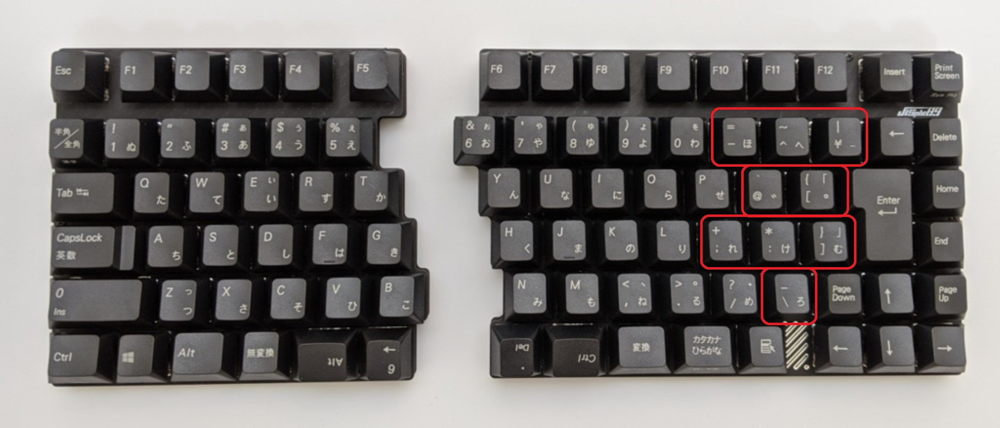
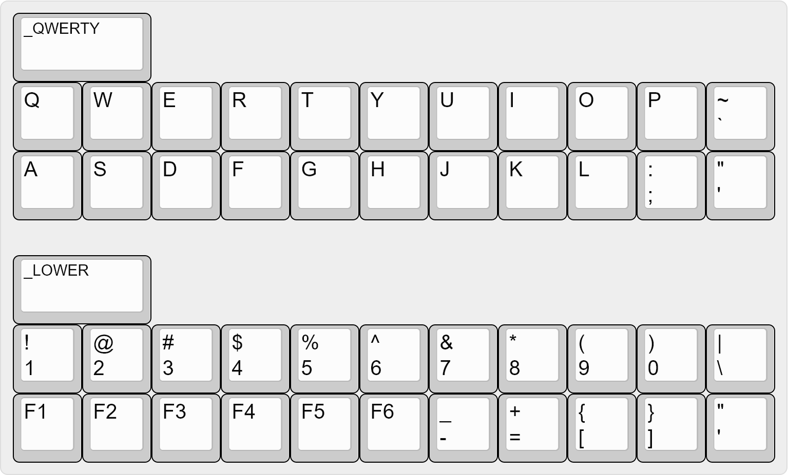

## 前置き

QMK Firmware は US 配列を前提にしたファームウェアなので、OS のキーボード配列を US キーボードにして US キーキャップを使う場合は、言語関係の問題は生じません。

しかし、OS のキーボード配列を JIS キーボードに設定すると、途端に言語関係の問題が生じます。対応方法は、US キーキャップを使う場合と JIS キーキャップを使う場合でそれぞれ違いますので、それぞれのパターンについて紹介したいと思います。

## tl,dl

JIS キーキャップを使う場合
: [qmk_firmware/keymap_japanese.h at master · qmk/qmk_firmware](https://github.com/qmk/qmk_firmware/blob/master/quantum/keymap_extras/keymap_japanese.h) を `keymap.c` の先頭で `#include"keymap_jp.h"` して読み込んだ上で、`KC_*` の代わりに `JP_*` キーを使います。

US キーキャップを使う場合
: この場合の方法は、次の2つです。

### 方法1

[koktoh/jtu_custom_keycodes: Keycodes to use jis keycode in us keymap](https://github.com/koktoh/jtu_custom_keycodes) を使い、個別に対応が必要なキーを `JU_*` キーに置き換えます。<br>ただし、`!` や `(` のように Shift キーを押しながら入力する記号類を直接入力する場合（例えば、Raise レイヤーで `Q` を押したら `!` が入力されるといったものです。）、[qmk_firmware/keymap_japanese.h at master · qmk/qmk_firmware](https://github.com/qmk/qmk_firmware/blob/master/quantum/keymap_extras/keymap_japanese.h) を使って `JP_EXLM` 等の形で指定する必要があります。[^1]

[^1]: S(JU_2) の形で指定したキーを押しても何も送信されませんので、`JP_EXLM` 等のキーコードを使う必要があります。

### 方法2

Version 0.14.0 で導入された Key Overrides 機能と `JP_*` キー を組み合わせてキーの挙動を変更するという方法です。

[QMK Breaking Changes - 2021 August 28 Changelog](https://docs.qmk.fm/#/ChangeLog/20210828)

一見すると回りくどい方法ですが、`JU_*` キーはキーリピートが効かないのに対し、この方法で設定したキーはキーリピートが効きますので、普通のキーの挙動に可能な限り近づけることができます。


## 解説

### 追加ライブラリまたは設定が必要な理由

`keymap.c` で `KC_A` と指定したキーをタイプした時、キーボードから PC に送信されるデータは `A` という文字に応じたキーコードです。そして、OS は受け取ったキーコードに応じた文字をアプリケーションに渡します。[^2]

[^2]: PC に送信されるキーコードは [qmk_firmware/keycode.h at master · qmk/qmk_firmware](https://github.com/qmk/qmk_firmware/blob/master/quantum/keycode.h) で定義されています。このキーコードは [USB 規格](https://www.usb.org/documents) の HID Usage Table で定められているコードを基にして、現在の OS では使われないコード (0xA5-0xDF) にメディアキー等が割り当てられています。

問題は、このキーコードと文字の対応関係が言語によって異なっており、例えば、`[` に当たる `KC_LBRC` のキーコードを送信しても、OS のキーボード配列が JIS になっていると OSは `=` を返してしまいます。

このような取り違えが生じるキーがいくつかありますので、OS のキーボード配列を JIS にした状態でキーキャップの印字通りに入力したい場合、何らかの変換処理が必要となります。

上記で紹介した [qmk_firmware/keymap_japanese.h at master · qmk/qmk_firmware](https://github.com/qmk/qmk_firmware/blob/master/quantum/keymap_extras/keymap_japanese.h) と [koktoh/jtu_custom_keycodes: Keycodes to use jis keycode in us keymap](https://github.com/koktoh/jtu_custom_keycodes) を使う方法は、ライブラリに変換処理を任せる方法で、Key Overrides を使う方法は自力で変換処理を行うという方法です。

## 実装

ここからは具体的な実装を紹介していきます。なお、OS のキーボード配列が JIS 配列になっていることが前提です。

### JIS キーキャップを使う場合

[qmk_firmware/keymap_japanese.h at master · qmk/qmk_firmware](https://github.com/qmk/qmk_firmware/blob/master/quantum/keymap_extras/keymap_japanese.h) を `keymap.c` の先頭で `#include"keymap_jp.h"` して読み込んで、`KC_*` の代わりに `JP_*` キーを使います。

以下のキーマップは、OS のキーボード配列とキーキャップを JIS にする前提で設計された [自作キーボードキット『JISplit89』ビルドガイド - 自作キーボード温泉街の歩き方](https://salicylic-acid3.hatenablog.com/entry/jisplit89-build-guide) のデフォルトキーマップですが、JIS キーキャップ独自のキー（下の図の赤枠のキー）のキーコードに `JP_*` キーコードを指定しています。

<figure class="figure bsimage">
  
  <figcaption class="figure-caption fw-light text-center">
		<a href="https://github.com/qmk/qmk_firmware/tree/master/keyboards/salicylic_acid3/jisplit89">qmk_firmware/keyboards/salicylic_acid3/jisplit89 at master · qmk/qmk_firmware </a>より
	</figcaption>
</figure>

```keymap.c
[_QWERTY] = LAYOUT(
   //,-----------------------------------------------------|   |--------------------------------------------------------------------------------.
        KC_ESC,   KC_F1,   KC_F2,   KC_F3,   KC_F4,   KC_F5,       KC_F6,   KC_F7,   KC_F8,   KC_F9,  KC_F10,  KC_F11,  KC_F12,  KC_INS, KC_PSCR,
   //|--------+--------+--------+--------+--------+--------|   |--------+--------+--------+--------+--------+--------+--------+--------+--------|
 LT(_ADJUST,KC_ZKHK),KC_1,  KC_2,    KC_3,    KC_4,    KC_5,        KC_6,    KC_7,    KC_8,    KC_9,    KC_0, JP_MINS, JP_CIRC,  JP_YEN, KC_BSPC,  KC_DEL,
   //|--------+--------+--------+--------+--------+--------|   |--------+--------+--------+--------+--------+--------+--------+--------+--------|
        KC_TAB,    KC_Q,    KC_W,    KC_E,    KC_R,    KC_T,        KC_Y,    KC_U,    KC_I,    KC_O,    KC_P,   JP_AT, JP_LBRC,  KC_ENT, KC_HOME,
   //|--------+--------+--------+--------+--------+--------|   |--------+--------+--------+--------+--------+--------+--------+--------+--------|
       KC_CAPS,    KC_A,    KC_S,    KC_D,    KC_F,    KC_G,        KC_H,    KC_J,    KC_K,    KC_L, JP_SCLN, JP_COLN, JP_RBRC,           KC_END,
   //|--------+--------+--------+--------+--------+--------|   |--------+--------+--------+--------+--------+--------+--------+--------+--------|
       KC_LSFT,    KC_Z,    KC_X,    KC_C,    KC_V,    KC_B,        KC_N,    KC_M, KC_COMM,  KC_DOT, KC_SLSH, JP_BSLS, KC_PGDN,   KC_UP, KC_PGUP,
   //|--------+--------+--------+--------+--------+--------|   |--------+--------+--------+--------+--------+--------+--------+--------+--------|
      KC_LCTRL, KC_LGUI, KC_LALT, KC_MHEN,  KC_SPC,  KC_SPC,      KC_SPC,  KC_SPC, KC_HENK, KC_KANA,  KC_APP,          KC_LEFT, KC_DOWN,KC_RIGHT
   //`-----------------------------------------------------|   |--------------------------------------------------------------------------------'
),
```

このように、JIS キーキャップと US キーキャップで印字が異なるキーについて、`JP_*` キーコードを使用して違いを吸収しています。

### US キーキャップを使う場合

#### `JU_*` を使う場合

[koktoh/jtu_custom_keycodes: Keycodes to use jis keycode in us keymap](https://github.com/koktoh/jtu_custom_keycodes) を使い、`;` や `'` のように Shift キーを使わなくてもキーキャップの印字通りに入力されないキーや、Shift キーを使った場合に印字通りに入力されない `2` や `6` について、`JU_*` キーを使って違いを吸収しています。

<figure class="figure bsimage">
  
  <figcaption class="figure-caption fw-light text-center">
		<a href="http://www.keyboard-layout-editor.com/##@_name=JIS%E9%85%8D%E5%88%97%E3%81%A8US%E9%85%8D%E5%88%97%E3%81%AE%E6%AF%94%E8%BC%83%E7%94%A82%3B&@_w:2%3B&=%2F_QWERTY%3B&@_f:5%3B&=Q&=W&=E&=R&=T&=Y&=U&=I&=O&=P&=~%0A%60%3B&@=A&=S&=D&=F&=G&=H&=J&=K&=L&=%2F:%0A%2F%3B&=%22%0A'%3B&@_y:0.5&f:3&w:2%3B&=%2F_LOWER%3B&@_f:5%3B&=!%0A1&=%2F@%0A2&=%23%0A3&=$%0A4&=%25%0A5&=%5E%0A6&=%2F&%0A7&=*%0A8&=(%0A9&=)%0A0&=%7C%0A%5C%3B&@=F1&=F2&=F3&=F4&=F5&=F6&=%2F_%0A-&=+%0A%2F=&=%7B%0A%5B&=%7D%0A%5D&=%22%0A'">Keyboard Layout Editor</a> で作成
	</figcaption>
</figure>

```keymap.c
[_QWERTY] = LAYOUT(
  KC_Q,  KC_W,  KC_E,  KC_R,  KC_T,  KC_Y,  KC_U,    KC_I,   KC_O,    KC_P,    JU_GRV,  \
  KC_A,  KC_S,  KC_D,  KC_F,  KC_G,  KC_H,  KC_J,    KC_K,   KC_L,    JU_SCLN, JU_QUOT, \
),
[_LOWER] = LAYOUT( \
  KC_1,  JU_2,  KC_3,  KC_4,  KC_5,  JU_6,  JU_7,    JU_8,   JU_9,    JU_0,    JU_BSLS, \
  KC_F1, KC_F2, KC_F3, KC_F4, KC_F5, KC_F6, JU_MINS, JU_EQL, JU_LBRC, JU_RBRC, _______,   \
),
```

なお、`JU_*` キーを使う場合、ライブラリとして読み込む方法とコードをコピペして使う方法の2つがあります。[jtu_custom_keycodes/default/README.md](https://github.com/koktoh/jtu_custom_keycodes/tree/master/default) に手順が記載されていますので、そちらを確認して実装します。

#### Key Overrides を使う方法

Key Overrides の詳細は、QMK Firmware の公式ドキュメントの[暫定日本語訳](https://github.com/qmk/qmk_firmware/blob/daa6ba4a11e6e02ec141e57324907066457afd64/docs/ja/feature_key_overrides.md) で確認できますが、この機能を簡単に説明すると、修飾キーとキーの組み合わせを上書きして別のキーを送信できるようにするというものです。PC に送信するキーコード自体を変更できますので、US と JIS の違いを吸収するのにうってつけの機能となります。

例えば、OS のキーボード配列が JIS だと `Shift + 2` は `"` と解釈されますが、Key Overrides を使うと `Shift + 2` を `JP_AT` に変換して PC に送信できますので、`Shift + 2` を押して `@` を表示させるということができるようになります。このように修飾キーとキーの組み合わせを上書きすることで、US キーキャップの印字通りの入力を実現できるようになります。

ここから具体的なコードを示しますが、まず、Key Overrides を使うには `rules.mk` に `KEY_OVERRIDE_ENABLE = yes` を追加する必要があります。

```rules.mk
KEY_OVERRIDE_ENABLE = yes
```

次に、`keymap.c` に Key Overrides の対象となるキーの組み合わせなどを定義した `key_override_t` 構造体を初期化します。

```keymap.c
// `shift + '` を上書きして `"` を送信する
const key_override_t JP_QUOT_key_override =
  ko_make_with_layers_and_negmods(MOD_MASK_SHIFT, JP_QUOT, S(KC_2), ~0, MOD_MASK_CAG);

// `shift + 2` を上書きして `@` を送信する
const key_override_t KC_2_key_override = 
  ko_make_with_layers_and_negmods(MOD_MASK_SHIFT, KC_2, KC_LBRC, ~0, MOD_MASK_CAG);
```

初期化で使っている `ko_make_with_layers_and_negmods` 初期化子は、最もオプションが多い初期化子で、Key Overrides を使うレイヤーや押してはいけない修飾キーを指定できます。1つ目の設定に指定している引数の内容は次のとおりです。

`MOD_MASK_SHIFT`
: Key Overrides を使うために押す必要がある修飾キーに Shift キーを指定しています。キーの指定は、`MOD_BIT(KC_RSFT)` のように `MOD_BIT()` を使うか、[モッドマスク](https://docs.qmk.fm/#/ja/feature_advanced_keycodes?id=checking-modifier-state)（`MOD_MASK_CTRL` 等）を使って行います。

`JP_QUOT`
: Key Overrides を使うために押す必要があるキーに `'` を指定しています。なお、`KC_QUOT` ではなく `JP_QUOT` としているのは、キーマップで `KC_QUOT` の代わりに `JP_QUOT` を指定しているためです。

`S(KC_2)`
: `"` を送信するためのキーコードを指定しています。OS のキーボード配列が JIS の場合に `"` を送信するには `S(KC_2)` と指定する必要がありますが、`JP_DQUO` と指定しても OK です。ここは好みで決めます。

`~0`
: 全てのレイヤーで Key Overrides を使うという指定です。レイヤー i でこのオーバーライドを使うには、i 番目のビット `(1 << i)` を設定します。

`MOD_MASK_CAG`
: Key Overrides を使うときに**押していてはいけない**修飾キーに `control`、`windows`、`alt` キーを指定しています。なお、押していてはいけない修飾キーを指定する場合、`shift`、`control`、`windows`、`alt` の4種類の修飾キーを「押す必要がある」と「押していてはいけない」のどちらかに指定する必要があります。指定漏れや重複指定があると Key Overrides が無効化されます。

それから、`key_overrides` 配列の要素に `key_override_t` 構造体を指定します。`key_overrides` 配列は NULL で終了し、`key_override_t` 値へのポインタ (const key_override_t **) を含みます。

```keymap.c
const key_override_t **key_overrides = (const key_override_t *[]){
    &JP_QUOT_key_override,
    &KC_2_key_override,
    NULL // Null terminate the array of overrides!
};
```

あとは、これを必要なキーの数だけ繰り返していきます。私が行った設定をキーマップと合わせて以下に示します。

```c
// 全レイヤーで Key Overrides を有効化
// Ctrl, Win, Altキーを押していたら Key Overrides を発動しない
const key_override_t JP_GRV_key_override = ko_make_with_layers_and_negmods(MOD_MASK_SHIFT, JP_GRV, S(KC_EQL), ~0, MOD_MASK_CAG);
const key_override_t KC_SCLN_key_override = ko_make_with_layers_and_negmods(MOD_MASK_SHIFT, KC_SCLN, KC_QUOT, ~0, MOD_MASK_CAG);
const key_override_t JP_QUOT_key_override = ko_make_with_layers_and_negmods(MOD_MASK_SHIFT, JP_QUOT, S(KC_2), ~0, MOD_MASK_CAG);
const key_override_t KC_2_key_override = ko_make_with_layers_and_negmods(MOD_MASK_SHIFT, KC_2, KC_LBRC, ~0, MOD_MASK_CAG);
const key_override_t KC_6_key_override = ko_make_with_layers_and_negmods(MOD_MASK_SHIFT, KC_6, KC_EQL, ~0, MOD_MASK_CAG);
const key_override_t KC_7_key_override = ko_make_with_layers_and_negmods(MOD_MASK_SHIFT, KC_7, S(KC_6), ~0, MOD_MASK_CAG);
const key_override_t KC_8_key_override = ko_make_with_layers_and_negmods(MOD_MASK_SHIFT, KC_8, S(KC_QUOT), ~0, MOD_MASK_CAG);
const key_override_t KC_9_key_override = ko_make_with_layers_and_negmods(MOD_MASK_SHIFT, KC_9, S(KC_8), ~0, MOD_MASK_CAG);
const key_override_t KC_0_key_override = ko_make_with_layers_and_negmods(MOD_MASK_SHIFT, KC_0, S(KC_9), ~0, MOD_MASK_CAG);
const key_override_t JP_BSLS_key_override = ko_make_with_layers_and_negmods(MOD_MASK_SHIFT, JP_BSLS, S(KC_INT3), ~0, MOD_MASK_CAG);
const key_override_t KC_MINS_key_override = ko_make_with_layers_and_negmods(MOD_MASK_SHIFT, KC_MINS, S(KC_INT1), ~0, MOD_MASK_CAG);
const key_override_t JP_EQL_key_override = ko_make_with_layers_and_negmods(MOD_MASK_SHIFT, JP_EQL, S(KC_SCLN), ~0, MOD_MASK_CAG);
const key_override_t JP_LBRC_key_override = ko_make_with_layers_and_negmods(MOD_MASK_SHIFT, JP_LBRC, S(KC_RBRC), ~0, MOD_MASK_CAG);
const key_override_t JP_RBRC_key_override = ko_make_with_layers_and_negmods(MOD_MASK_SHIFT, JP_RBRC, S(KC_NUHS), ~0, MOD_MASK_CAG);

const key_override_t **key_overrides = (const key_override_t *[]){
    &JP_GRV_key_override,
    &KC_SCLN_key_override,
    &JP_QUOT_key_override,
    &KC_2_key_override,
    &KC_6_key_override,
    &KC_7_key_override,
    &KC_8_key_override,
    &KC_9_key_override,
    &KC_0_key_override,
    &JP_BSLS_key_override,
    &KC_MINS_key_override,
    &JP_EQL_key_override,
    &JP_LBRC_key_override,
    &JP_RBRC_key_override,
    NULL // Null terminate the array of overrides!
};
// key override setting end

/* keymap */
const uint16_t PROGMEM keymaps[][MATRIX_ROWS][MATRIX_COLS] = { \
  [_QWERTY] = LAYOUT(
      KC_TAB,   KC_Q,   KC_W,    KC_E,    KC_R,  KC_T,         KC_Y,    KC_U,  KC_I,    KC_O,    KC_P,    JP_GRV,  \
      KC_LCTL,  KC_A,   KC_S,    KC_D,    KC_F,  KC_G,         KC_H,    KC_J,  KC_K,    KC_L,    KC_SCLN, JP_QUOT, \
      KC_LSFT,  KC_Z,   KC_X,    KC_C,    KC_V,  KC_B,         KC_N,    KC_M,  KC_COMM, KC_DOT,  KC_SLSH, KC_ENT,  \
      KC_LANG2, KC_ESC, KC_LALT, KC_LGUI, LOWER, KC_SPC,       KC_BSPC, RAISE, KC_RGUI, KC_RALT, KC_RCTL, KC_LANG1 \
      ),

  [_LOWER] = LAYOUT( \
      JP_ZKHK, KC_1,    KC_2,    KC_3,    KC_4,    KC_5,       KC_6,   KC_7,    KC_8,    KC_9,    KC_0,    JP_BSLS, \
      _______, KC_F1,   KC_F2,   KC_F3,   KC_F4,   KC_F5,      KC_F6,  KC_MINS, JP_EQL,  JP_LBRC, JP_RBRC, _______,   \
      _______, KC_F7,   KC_F8,   KC_F9,   KC_F10,  KC_F11,     KC_F12, KC_APP,  JP_LPRN, JP_RPRN, _______, _______, \
      _______, _______, _______, _______, _______, _______,    KC_DEL, _______, _______, _______, _______, _______ \
      ),

  [_RAISE] = LAYOUT( \
      KC_AGRV, KC_NO,   KC_PGUP, KC_NO,   KC_NO,   KC_NO,      KC_NO,    KC_NO,   KC_INS,  KC_NO,   KC_PSCR, KC_NO,   \
      _______, KC_HOME, KC_PGDN, KC_END,  KC_NO,   KC_NO,      KC_LEFT,  KC_DOWN, KC_UP,   KC_RGHT, KC_NO,   KC_NO,   \
      _______, KC_NO,   KC_NO,   KC_NO,   KC_NO,   KC_NO,      KC_NO,    KC_NO,   _______, _______, _______, _______, \
      _______, _______, _______, _______, _______, KC_ENT,     _______,  _______, _______, _______, _______, _______ \
      ),

    [_ADJUST] =  LAYOUT( \
      RESET,   JP_EXLM, JP_AT,   JP_HASH, JP_DLR,  JP_PERC,    JP_CIRC, JP_AMPR,  JP_ASTR, JP_LPRN, JP_RPRN,  KC_NO, \
      DEBUG,   KC_NO,   KC_NO,   KC_NO,   KC_NO,   KC_NO,      KC_NO,   KC_NO,    KC_NO,   KC_CAD,  KC_APSCR, KC_NO,\
      _______, KC_NO,   KC_NO,   KC_NO,   KC_NO,   KC_NO,      KC_NO,   KC_NO,    _______, _______, _______,  _______, \
      _______, _______, _______, _______, _______, _______,    _______, _______,  _______, _______, _______,  _______ \
      )
};
```
